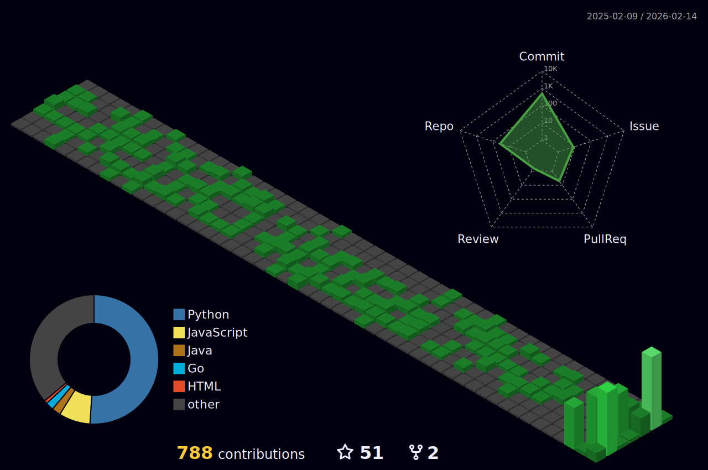

Retro-futuristic • pixelart

  

  

<b>Hey, I'm Charlie</b>

  <b>Nairobi-based software & data engineer</b> · schema-first systems that last · <i>Schemas before scripts · Meaning before motion</i>

  
  
  
  

<b>Focus</b>

  FinTech & Risk · Health Systems · Climate & Social Economics · Governance & Gender Equity · Mathematics & Education · <i>Clarity over cleverness. Docs first.</i>

<b>Key Projects</b>

<b>FinTech Risk Lab</b>

  Credit risk & fraud analytics (Python + Oracle SQL) — robust, auditable pipelines.

  
  

<b>Climate & Social Economics Dashboard</b> (WIP)

  Indicators & visualizations (R + JavaScript) — clarity + comparability.

  

<b>Health Data Pipelines</b> (WIP)

  Clean, reproducible ETL patterns (Go + SQL) — reliability + traceability.

  

<b>Portfolio Projects</b>

  Small, focused demos built with clean commit history (9 each) — variety across stacks

  
  
  
  

<b>Stack</b>

  
  
  
  
  

  
  
  
  
  

  
  
  
  
  

  

<b>Connect</b>

  
  
  

  Don’t wait to feel better to do things. You’ll need to do things to feel better.

  <i>I design systems that survive audits, scale, and time.</i>

